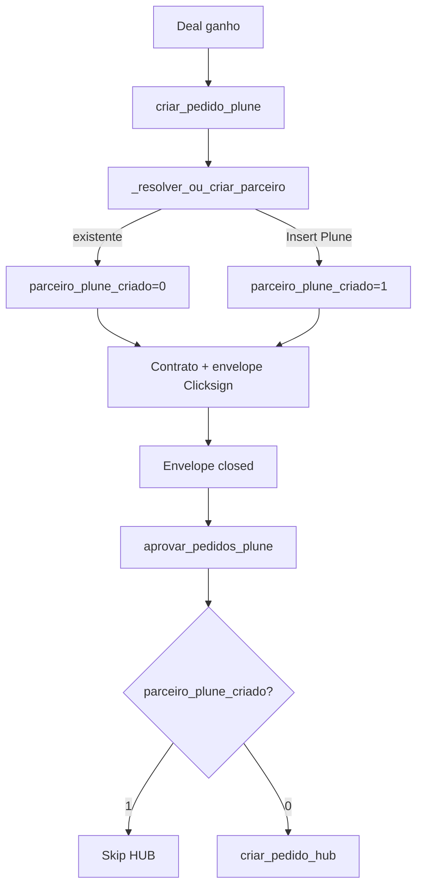

# HUB — Integração com AutomacaoGebras

## Fluxo fim a fim



## Pontos de código

| Etapa | Arquivo | Função |
|-------|---------|--------|
| Ganho / Plune | `core/automacao_contrato.py` | `processar_deals_pendentes` → `criar_pedido_plune` |
| Flag parceiro | `core/database.py` | `salvar_envelope_pendente(parceiro_plune_criado=…)` |
| Pós-assinatura (produção) | `core/automacao_contrato.py` | `processar_contratos_assinados` → `tentar_criar_pedido_hub_deal` |
| Ganho (dev) | `core/automacao_contrato.py` | `_fluxo_hub_apos_plune` se `DEV_HUB_SEM_APROVACAO_PLUNE=1` |
| INSERT HUB | `core/hub_pedido.py` | `criar_pedido_hub` |

## Estado MySQL (`gebras_automacao`)

Colunas em `envelopes_pending` (schema v9):

| Coluna | Significado |
|--------|-------------|
| `parceiro_plune_criado` | 1 = parceiro foi criado no Plune no ganho |
| `hub_pedido_criado` | 1 = pedido HUB criado pela automação |
| `pedido_hub_id` | `pedido.codigo` no HUB |

## Reprocessar deal — `rm deal`

```bash
python scripts/automacao_db.py rm deal 746 -y
```

[`limpar_estado_deal`](../../core/database.py):

1. Lê `pedido_hub_id` / `hub_pedido_criado` **antes** de apagar o envelope.
2. Se `hub_pedido_criado` → `remover_pedido_hub` (filhos + `pedido`).
3. Apaga estado local: `deals_processed`, `envelopes_pending`, `pedidos_plune_keys`.

**Não** remove pedidos no Plune (apenas estado e HUB).

## Modo desenvolvimento — HUB sem aprovação Plune

| Variável | Valor | Comportamento |
|----------|-------|----------------|
| `DEV_HUB_SEM_APROVACAO_PLUNE` | `false` (produção) | HUB só após `aprovar_pedidos_plune` (envelope fechado) |
| `DEV_HUB_SEM_APROVACAO_PLUNE` | `true` | HUB logo após `criar_pedido_plune` no ganho |

Combine com `DEV_PULAR_CLICKSIGN=true` quando não houver envelope: o sistema grava um registro stub em `envelopes_pending` (`garantir_envelope_para_hub`) para manter flags e `pedido_hub_id`.

Requer `HUB_CODIGO_USUARIO_SISTEMA` e pedidos Plune já criados (números para `pedido_plune`).

## Dois bancos

| Variável | Database |
|----------|----------|
| `MYSQL_DATABASE` | `gebras_automacao` |
| `MYSQL_DATABASE_HUB` | `gebras` |

Mesmo host/credenciais em `.env`.
